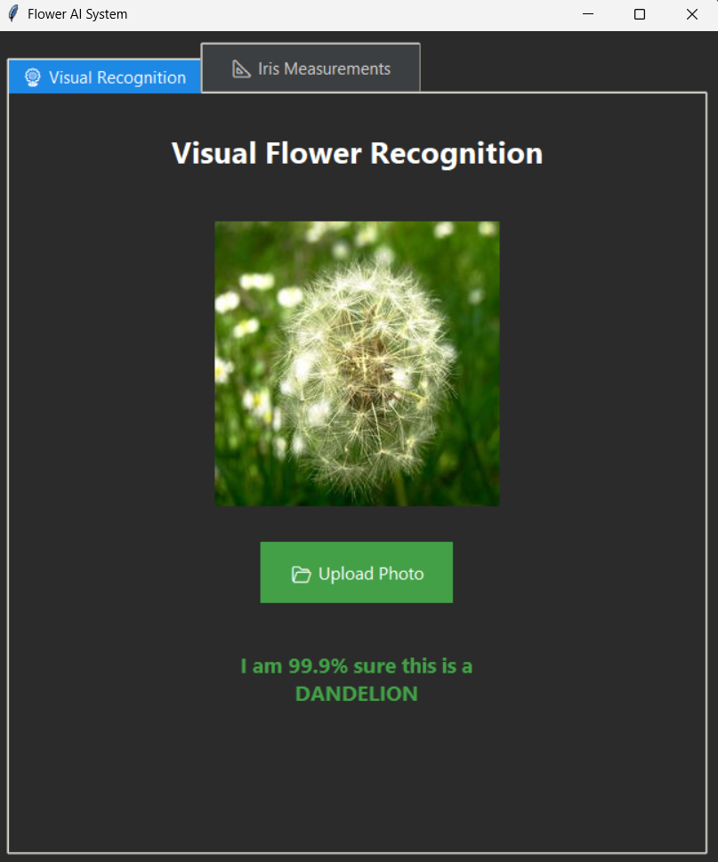
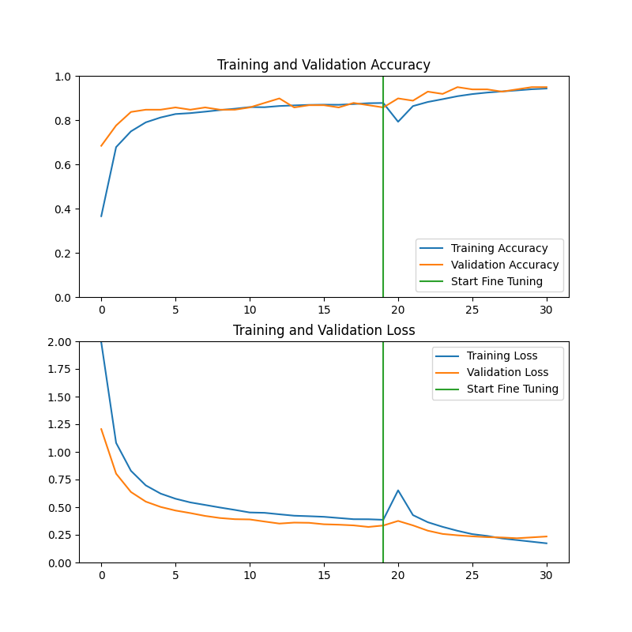

# 🌻 Flower AI System

A comprehensive dual-mode Artificial Intelligence application that combines deep learning for computer vision with traditional machine learning for tabular data analysis, all wrapped in a modern, dark-themed graphical interface.



## ✨ Overview

Flower AI is an educational and practical demonstration of modern machine learning techniques, featuring:
- **Deep Learning** for visual flower species recognition
- **Traditional ML** for iris classification based on measurements
- **User-friendly GUI** with dark mode aesthetics
- **High accuracy** models ready for immediate use

---

## 🚀 Features

### 📷 Visual Recognition Mode (Deep Learning)

Leverages **Transfer Learning** with MobileNetV2 architecture to identify flower species from images.

- **Accuracy:** ~95%
- **Supported Classes:** 14 Flower Species
  - Rose, Tulip, Sunflower, Dandelion, Daisy, Lotus, Orchid, Carnation, Lily, Iris, Magnolia, Poppy, Marigold, Lavender
- **Technology:** Convolutional Neural Networks (CNN) via TensorFlow/Keras
- **Pre-trained Base:** MobileNetV2 (ImageNet weights)
- **Custom Fine-tuning:** Trained on curated flower dataset

### 📊 Iris Measurements Mode (Traditional ML)

Uses a **Random Forest Classifier** to classify iris flowers based on physical measurements.

- **Accuracy:** ~100% (on test set)
- **Input Features:**
  - Sepal Length (cm)
  - Sepal Width (cm)
  - Petal Length (cm)
  - Petal Width (cm)
- **Output Classes:** Setosa, Versicolor, Virginica
- **Technology:** Scikit-Learn Ensemble Learning

---

## 📈 Model Performance

### Training Curves



The image classification model demonstrates excellent learning characteristics:
- **Initial Training:** Base model with frozen layers
- **Fine-tuning Phase:** Unfrozen top layers for domain adaptation
- **Final Validation Accuracy:** 95%+
- **Training Duration:** 30 epochs with early stopping

---

## 🛠️ Installation

### Prerequisites

- Python 3.8 or higher
- pip package manager
- (Optional) Virtual environment tool

### Step 1: Clone the Repository

```bash
git clone https://github.com/KARAN-1309/FlowerAI.git
cd FlowerAI
```

### Step 2: Create Virtual Environment (Recommended)

```bash
# Windows
python -m venv venv
venv\Scripts\activate

# macOS/Linux
python3 -m venv venv
source venv/bin/activate
```

### Step 3: Install Dependencies

```bash
pip install -r requirements.txt
```

### Step 4: Run the Application

```bash
python gui_app.py
```
---

## 🧠 Technical Architecture

### Technology Stack

| Component | Technology |
|-----------|-----------|
| **GUI Framework** | Python `tkinter` with `ttk` styling |
| **Deep Learning** | TensorFlow/Keras 2.x |
| **Traditional ML** | Scikit-Learn |
| **Image Model** | MobileNetV2 (Transfer Learning) |
| **Tabular Model** | Random Forest Classifier |
| **Deployment** | PyInstaller for standalone builds |

### Project Structure

```
FlowerAI/
│
├── gui_app.py                      # Main GUI application entry point
├── train_classifier.py             # Training script for image model
├── train_iris.py                   # Training script for iris model
├── predict.py                      # CLI utility for quick predictions
│
├── models/
│   ├── flower_classifier_model.keras   # Saved deep learning model
│   ├── iris_tabular_model.pkl          # Saved random forest model
│   └── iris_label_encoder.pkl          # Saved label encoder
│
├── assets/
│   ├── training_results.png        # Model performance graphs
│   └── gui_screenshot.png          # Application screenshot
│
├── requirements.txt                # Python dependencies
├── README.md                       # Project documentation
└── LICENSE                         # MIT License
```

---

## 🎯 Usage

### Visual Recognition Mode

1. Launch the application
2. Navigate to the **Visual Recognition** tab
3. Click **Browse** to select a flower image
4. Click **Classify** to get prediction
5. View results with confidence scores

### Iris Classification Mode

1. Navigate to the **Iris Measurements** tab
2. Enter measurements:
   - Sepal Length (4.0 - 8.0 cm)
   - Sepal Width (2.0 - 5.0 cm)
   - Petal Length (1.0 - 7.0 cm)
   - Petal Width (0.1 - 3.0 cm)
3. Click **Classify**
4. View predicted iris species

### Command Line Prediction

```bash
python predict.py --image path/to/flower.jpg
```

---

## 🔧 Development

### Training the Image Model

```bash
python train_classifier.py
```

**Configuration:**
- Batch size: 32
- Image size: 224×224
- Optimizer: Adam with learning rate scheduling
- Data augmentation: Rotation, flip, zoom, shift

### Training the Iris Model

```bash
python train_iris.py
```

**Configuration:**
- Estimators: 100 trees
- Max depth: Auto
- Cross-validation: 5-fold

---

## 📊 Dataset Information

### Flower Dataset
- **Source:** Custom curated dataset
- **Size:** ~2,000 images across 14 classes
- **Split:** 80% training, 20% validation
- **Augmentation:** Yes (rotation, flip, zoom)

### Iris Dataset
- **Source:** Classic UCI Machine Learning Repository
- **Size:** 150 samples (50 per class)
- **Features:** 4 numerical measurements
- **Split:** 80% training, 20% testing

---

**Made with ❤️ and Python**
